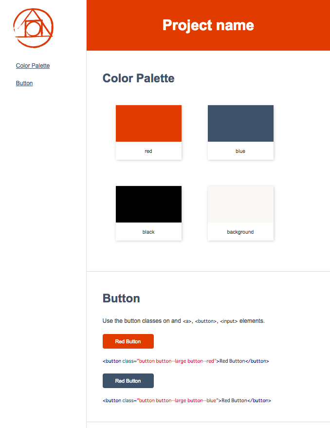

# postcss-style-guide [](https://travis-ci.org/morishitter/postcss-style-guide)

[PostCSS](https://github.com/postcss/postcss) plugin to generate a style guide automatically.

CSS comments will be parsed through Markdown and displayed in a generated HTML document.

## Install

```shell
$ npm install postcss-style-guide
```

## Usage

Node.js:

```js
var fs = require('fs');
var postcss = require('postcss');
var styleGuide = require('postcss-style-guide');

var css = fs.readFileSync('input.css', 'utf-8');
var processedCSS = fs.readFileSync('output.css', 'utf-8');

var options = {
    name: "Project name"
};

var output = postcss()
    .use(styleGuide(processedCSS, options))
    .process(css)
    .css;
```

in [Gulp](https://github.com/gulpjs/gulp):

```js
var gulp = require('gulp');

gulp.task('default', function () {
    var postcss = require('gulp-postcss');
    var processedCSS = 'output.css';
    return gulp.src('src/*.css')
        .pipe(postcss([
            require('postcss-style-guide')(processedCSS, {
                name: "Project name"
            })
        ]))
        .pipe(gulp.dest('build/'));
});
```

Using this `input.css`:

```css
/*
# I love Twitter Bootstrap

Use the button classes on an `<a>`, `<button>`, `<input>` element.

<button class="btn">Button</button>

    <button class="btn">Button</button>

*/

.btn {
  display: inline-block;
  padding: 6px 12px;
  margin-bottom: 0;
  font-size: 14px;
  font-weight: normal;
  line-height: 1.42857143;
  text-align: center;
  white-space: nowrap;
  vertical-align: middle;
  touch-action: manipulation;
  cursor: pointer;
  user-select: none;
  background-image: none;
  border: 1px solid transparent;
  border-radius: 4px;
}
.btn:hover,
.btn:focus,
.btn.focus {
  color: #333;
  text-decoration: none;
}

```

You will get `styleguide.html` for the style guide.



Default template design is inspired by [http://codeguide.co/](http://codeguide.co/).

## Options

- `options.theme`: Theme name
- `options.name`: Project name
- `options.file`: Style guide file name
- `options.showCode`: The flag to show CSS code. Default is `true`.

## Themes

You can select a theme of style guide with `options.theme`.
And you can also create original themes.
When you create themes, please read [theme guideline](https://github.com/morishitter/postcss-style-guide/blob/master/docs/theme-guideline.md)

All of postcss-style-guide themes that can be used are [here](https://www.npmjs.com/search?q=psg-theme).

### Themes list

- [default](https://github.com/morishitter/psg-theme-default)
- [sassline](https://github.com/sotayamashita/psg-theme-sassline)
- [1column](https://github.com/seka/psg-theme-1column)
- [forest](https://github.com/morishitter/psg-theme-forest)

### How to develop postcss-style-guide theme

- [Yeoman Generator](https://github.com/sotayamashita/generator-psg-theme)

## License

The MIT License (MIT)

Copyright (c) 2015 Masaaki Morishita
